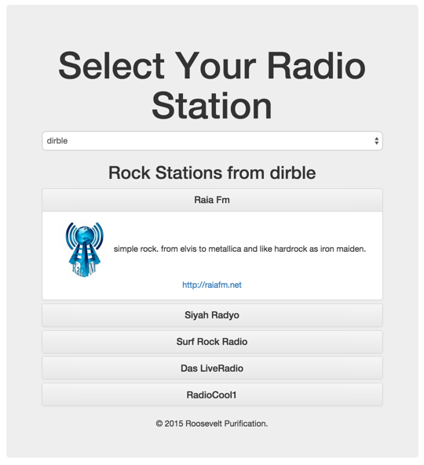

Sample Laravel & Bootstrap Application
======================================

A sample web application written in Laravel 5, Bootstrap and jQuery.

## Getting Started

- Download and install VirtualBox from here: https://www.virtualbox.org/wiki/Downloads
- Download and install Vagrant from here: https://www.vagrantup.com/downloads.html
- Open the terminal and execute the following commands:

```
cd ~/
git clone https://github.com/rooseveltrp/sample_laravel_bootstrap
cd sample_laravel_bootstrap
vagrant up
```

**Please wait until Vagrant downloads the required box and finishes configuring the VM.**

- Open your favorite web browser and visit http://192.168.33.10/ to test the app.

## Running PHPUnit Tests

```
cd ~/sample_laravel_bootstrap
vagrant ssh
cd /var/www
php vendor/bin/phpunit
```

## Sample Screenshot

